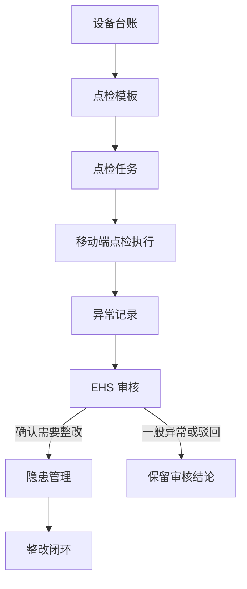
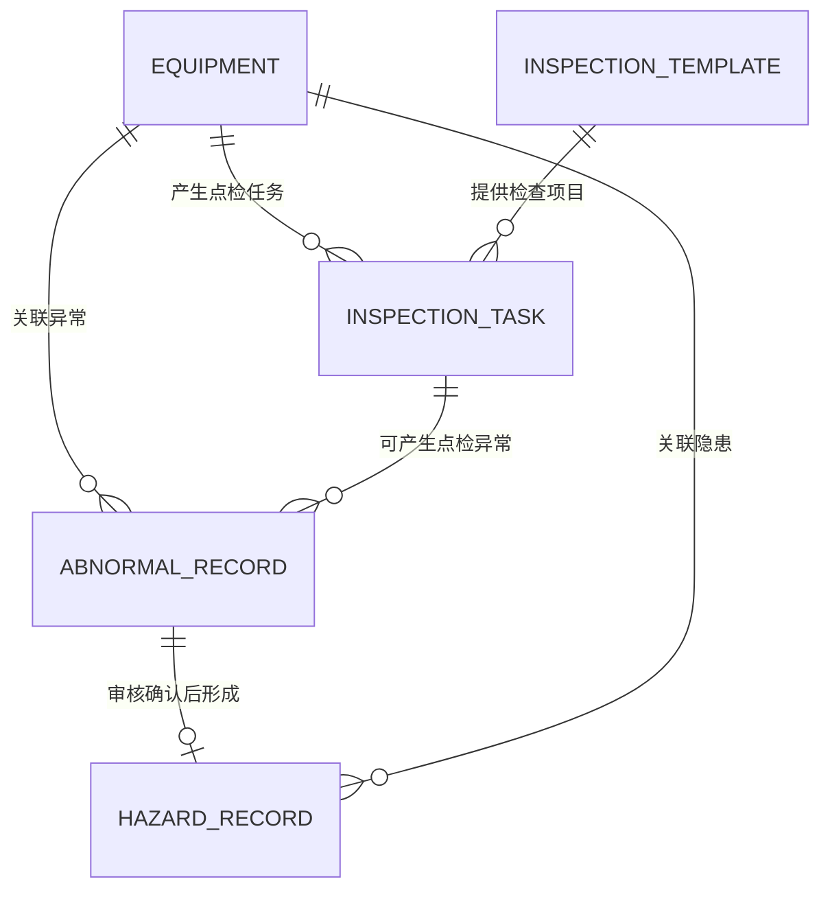
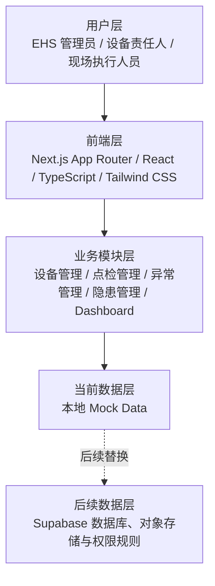
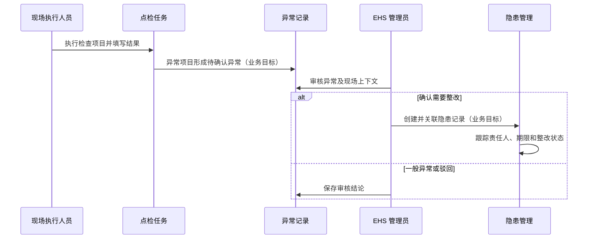

# SafeLoop 系统架构说明

## 1. 系统定位

SafeLoop 是面向制造企业、研发中心和实验室场景的 EHS（环境、健康与安全）数字化管理平台原型。它以日常设备安全管理为切入点，通过统一的业务对象和页面流程连接设备管理、现场点检、异常发现、EHS 审核与隐患跟踪。

系统的目标不是替代专业安全判断或生成法规结论，而是让设备状态、点检事实和问题处理过程能够被清晰记录与追溯。当前版本使用本地模拟数据，主要用于验证业务流程、信息结构和响应式交互体验。

## 2. 业务架构

各环节的作用如下：

| 环节 | 作用 |
| --- | --- |
| 设备台账 | 维护设备基础信息、所在位置、责任人、状态、风险等级及点检设置，是后续业务关联的基础。 |
| 点检模板 | 为特定设备类别定义可复用的检查项目、检查内容和判断标准。 |
| 点检任务 | 将设备和模板关联为一次待执行的现场点检工作，并记录计划日期、执行人员和任务状态。 |
| 移动端点检执行 | 让现场执行人员按检查项目填写正常或异常结果；异常项目需要补充描述。 |
| 异常记录 | 保存现场发现的问题事实，以及设备、点检任务和检查项目等上下文。 |
| EHS 审核 | 由 EHS 管理人员判断异常是否需要进入正式整改闭环，或作为一般异常、驳回记录处理。 |
| 隐患管理 | 对已确认需要整改的问题跟踪等级、责任人、期限、整改状态和复查信息。 |
| 整改闭环 | 代表后续整改、复查与关闭的业务目标；当前原型仅展示相关状态和信息，不支持真实提交。 |

## 3. 核心业务对象关系

- `equipment` 是设备主数据，是点检、异常和隐患的基础关联对象。
- `inspection_template` 定义某类设备的检查项目；`inspection_task` 将设备与模板、计划日期和执行人员组合为一次具体任务。
- `abnormal_record` 可以来自点检执行，也可以来自现场人员的主动上报。点检来源的异常可保留任务、点检记录和检查项目关系。
- `hazard_record` 只能来源于经 EHS 审核后状态为“已确认隐患”的异常。第一版设计中，一条异常最多对应一条隐患，确保来源可追溯。

这里需要明确区分：异常是现场发现的问题事实；隐患是 EHS 确认后需要进入正式整改闭环的问题。二者使用独立的状态和等级，不应混用。

## 4. 技术架构

当前前端采用 Next.js App Router 组织页面和布局，React 负责交互状态，TypeScript 用于约束业务数据结构，Tailwind CSS 提供响应式界面样式。系统面向电脑、平板和手机使用：管理列表在桌面端使用表格呈现，在手机端转换为更适合现场浏览的卡片布局；点检执行页则优先适配移动端。

角色在当前版本中用于表达业务边界，而非真实的登录权限控制：

- EHS 管理员负责审核异常、确认隐患并跟踪整改闭环；
- 设备责任人负责关注关联设备及其后续处理；
- 现场执行人员负责按任务完成点检并记录现场异常。

## 5. 数据流说明

在当前原型中，点检页面会校验检查结果和异常描述，并给出模拟提交提示；异常、审核和隐患状态则通过本地数据展示。上述数据流体现的是系统的业务设计，并不表示当前已经具备跨页面保存、自动创建记录或真实状态流转能力。

## 6. 当前版本限制

- 使用本地模拟数据，不连接 Supabase 或其他数据库；
- 未实现真实登录、用户角色权限和数据范围控制；
- 未实现消息通知、逾期提醒或自动任务生成；
- 未实现真实照片上传、对象存储或二维码扫描；
- 未实现真实的异常审核、隐患创建、整改提交、复查和关闭操作；
- 页面中的部分按钮和提交反馈仅用于演示前端交互，不会持久化保存数据。

## 7. 后续扩展方向

后续可在保持现有业务边界的基础上逐步扩展：

1. 接入 Supabase，承载设备、任务、异常、隐患和操作日志等核心数据，并实现数据持久化。
2. 增加用户、角色与行级数据权限，使 EHS 管理员、设备责任人和现场执行人员拥有符合职责范围的访问能力。
3. 增加消息提醒与待办机制，用于任务到期、异常待审核、整改临期和复查待办等场景。
4. 开发整改记录和 EHS 复查页面，形成可提交、可追溯的整改闭环。
5. 在业务数据和权限边界稳定后，探索 AI 辅助分析，例如对已沉淀的异常描述进行分类或汇总；AI 输出应作为辅助信息，不替代 EHS 人员的专业审核与决策。
